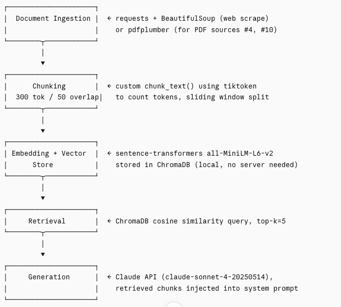

# Project 1 Planning: The Unofficial Guide

> Write this document before you write any pipeline code.
> Your spec and architecture diagram are what you'll use to direct AI tools (Claude, Copilot, etc.) to generate your implementation — the more specific they are, the more useful the generated code will be.
> Update the Retrieval Approach and Chunking Strategy sections if you change your approach during implementation.
> Update this file before starting any stretch features.

---

## Domain

<!-- What domain did you choose? Why is this knowledge valuable and hard to find through official channels? -->
I choose the campus dining domain at the University of Florida. This domain is hard to find as information changes frequently as new plans are added and removed. I am able to mix personal experiences with all the information a user needs.
---

## Documents

<!-- List your specific sources: URLs, subreddit names, forum threads, or file descriptions.
     Aim for at least 10 sources that together cover different subtopics or perspectives within your domain. -->

| # | Source | Description | URL or location |
|---|--------|-------------|-----------------|
| 1 | Business Services at University of Florida | Student mean plan terms and conditions, official rules, swipe limits, grace periods, etc| https://businessservices.ufl.edu/2025-2026-terms-conditions/ |
| 2 | Florida Fresh Dining| Shows new technologies and food spots around campus. Main points include variety, a better food and service experience | https://businessservices.ufl.edu/2022/10/10/florida-fresh-dining-introduces-new-food-concepts-new-technology-and-mobile-ordering-at-uf/ |
| 3 | Business Services at Universiy of Florida | Food Service Master Plan, independent audit of all 45 UF dining locations | https://businessservices.ufl.edu/wp-content/uploads/2020/01/Food-Svcs-Master-Plan-Report_Final_December-2019.pdf|
| 4 | Florida Alligator | A personal look on the UF vegan dining experience | https://www.alligator.org/article/2024/01/uf-vegan-experience |
| 5 | Spoon University | Student review over UF latest dining hall | https://spoonuniversity.com/school/ufl/reviewing-the-new-dining-hall/ |
| 6 | HerCampus UFL | A personal look on living with dietary restrictions in college, what options there are | https://www.hercampus.com/school/ufl/living-dietary-restrictions-college/ |
| 7 | University of Florida | Overview of the dining program at the University of Florida |  https://businessservices.ufl.edu/services/dining/ |
| 8 | GatorCare UF | Options about every option open on campus and information| https://ufh-gatorcare.sites.medinfo.ufl.edu/files/2015/09/Campus-Food-Resources-V5.pdf |
| 9 | Prked | A guide to choosing the best meal plan for your budget | https://prked.com/post/guide-to-uf-meal-plans-2024-2025 |
| 10 | Florida Allgiator | Bite Club, a new student meal plan altnerative | https://www.alligator.org/article/2024/09/what-to-know-about-a-new-student-meal-plan-alternative |

---

## Chunking Strategy

<!-- How will you split documents into chunks?
     State your chunk size (in tokens or characters), overlap size, and explain why those
     numbers fit the structure of your documents.
     A review-heavy corpus warrants different chunking than a long FAQ. -->

All sources are all short-to-medium form, and information tends to live in 2-4 sentence chunks. 300 Tokens captures a complete through without pulling in unrelated content from the same page. I chose an overlap size of 50 otkens to ensure a sentence overlaps a chunk boundary.

**Chunk size:** 300 Tokens

**Overlap:** 50 tokens

**Reasoning:**

---

## Retrieval Approach

<!-- Which embedding model are you using (e.g., all-MiniLM-L6-v2 via sentence-transformers)?
     How many chunks will you retrieve per query (top-k)?
     If you were deploying this for real users and cost wasn't a constraint, what tradeoffs
     would you weigh in choosing a different embedding model — context length, multilingual
     support, accuracy on domain-specific text, latency? -->

     Im using all-MiniLM-L6-v2 via sentence-transformers as my embedding model as its fast and cheap and trained on general web text which performs well in this scenario since most of the information can be found on the web. I will retrieve 5 chunks per query

**Embedding model:** all-MiniLM-L6-v2 via sentence-transformers

**Top-k:** 5

**Production tradeoff reflection:** all-MiniLM-L6-v2 via sentence-transformers is trained on general web text and may underperform on specific vocabulary but for general experiences it will be adequate and will provide fast and effective answers.

---

## Evaluation Plan

<!-- List your 5 test questions with their expected correct answers.
     Questions should be specific enough that you can judge whether the system's response
     is right or wrong. "What are good dining halls?" is too vague.
     "What do students say about wait times at [dining hall name] during lunch?" is testable. -->

| # | Question | Expected answer |
|---|----------|-----------------|
| 1 | What happens to unused flex dollars at the end of the spring semester at UF? | They expire and are forfeited — flex rolls over fall-to-spring but all unused flex is lost at end of spring.|
| 2 | What do UF students say about vegan options at Broward and Gator Corner dining halls? | Students say options exist but are limited; the campus dietitian acknowledged gaps and added items like tofu scramble and lentil soup. |
| 3 | How often can a student swipe into a UF dining hall within a single day? | Once every 45 minutes per swipe, at either The Eatery at Broward Hall or the Food Hall at Gator Corner. |
| 4 | What is Cravings Campus Kitchen and how does it compare to Broward and Gator Corner?| It's UF's newest dining hall at the Racquet Club, reviewed by students as higher quality than the two main buffet-style halls, but with long lines. |
| 5 | What was the student complaint that led to the creation of the Bite Club meal plan alternative? | Students felt locked into expensive UF meal plans with unused meals they couldn't roll over, and no option to eat at off-campus restaurants. |

---

## Anticipated Challenges

<!-- What could go wrong? Name at least two specific risks with reasoning.
     Consider: noisy or inconsistent documents, missing source attribution, off-topic
     retrieval, chunks that split key information across boundaries. -->

1. Official sources drowning out student voice, UF's official sources use promotional language that uses keywords like "quality" and "variety" positively, this may confuse the model and cause it to retrieve those chunks over the ones from personal experiences like Florida Alligator and Spoon University where students give honest negative opinions. This is because the official documents are longer and keyword denser. This creates a retrieval bias towards the instituitons framing rather than the student experience that the guide is meant to surface.

2. Chunk boundaries splitting key information across boundaries, the Food Service Master Plan PDF our denser pros were a single paragraph and the other sources might contain the entire Takeaway. A fixed size split at 300 tokens could put the number in one chunk and the interpretation in the next which could result in an incomplete answer with no context.

---

## Architecture

<!-- Draw a diagram of your pipeline showing the five stages:
     Document Ingestion → Chunking → Embedding + Vector Store → Retrieval → Generation
     Label each stage with the tool or library you're using.
     You can use ASCII art, a Mermaid diagram, or embed a sketch as an image.
     You'll use this diagram as context when prompting AI tools to implement each stage. -->

---

## AI Tool Plan
For each part of the pipeline I will use Claude.
<!-- For each part of the pipeline below, describe:
     - Which AI tool you plan to use (Claude, Copilot, ChatGPT, etc.)
     - What you'll give it as input (which sections of this planning.md, which requirements)
     - What you expect it to produce
     - How you'll verify the output matches your spec

     "I'll use AI to help me code" is not a plan.
     "I'll give Claude my Chunking Strategy section and ask it to implement chunk_text()
     with my specified chunk size and overlap" is a plan. -->

Chunking:
I will give Claude my Chunking Strategy and expect it to produce a working chunk_text() with my specificed chunk size and overlap.

Embedding and Vector Storage:
I will give Claude my Architecture diagram and library choices which is ChromaDB and it should implement the embed_And_store function which encodes chunks and upserts them into a Chroma collection.

Retrieval:
I will give Claude my Retrieval Approach and expecit it to produce a working retrieve function correctly using top_k value of 5 and all-MiniLM-L6-v2 via sentence-transformers model and it should return the top-5 chunks with their source URLs

Generation:
I will give claude the full pipeline spec  and expect it to implement a generate_answer function that formats a system prompt with all the given context.

**Milestone 3 — Ingestion and chunking:**

**Milestone 4 — Embedding and retrieval:**

**Milestone 5 — Generation and interface:**
